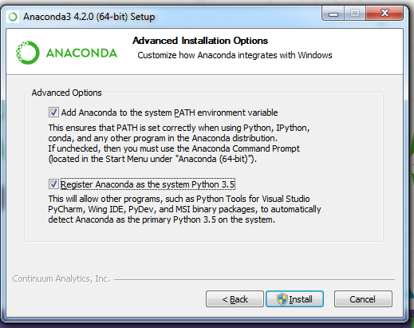
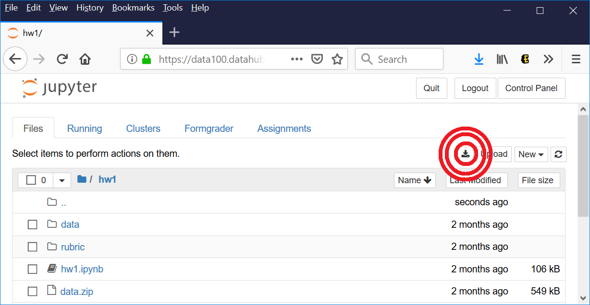
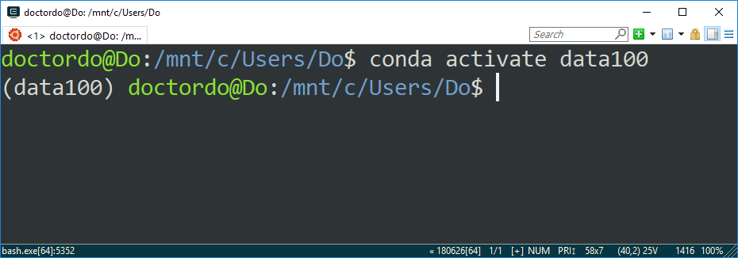
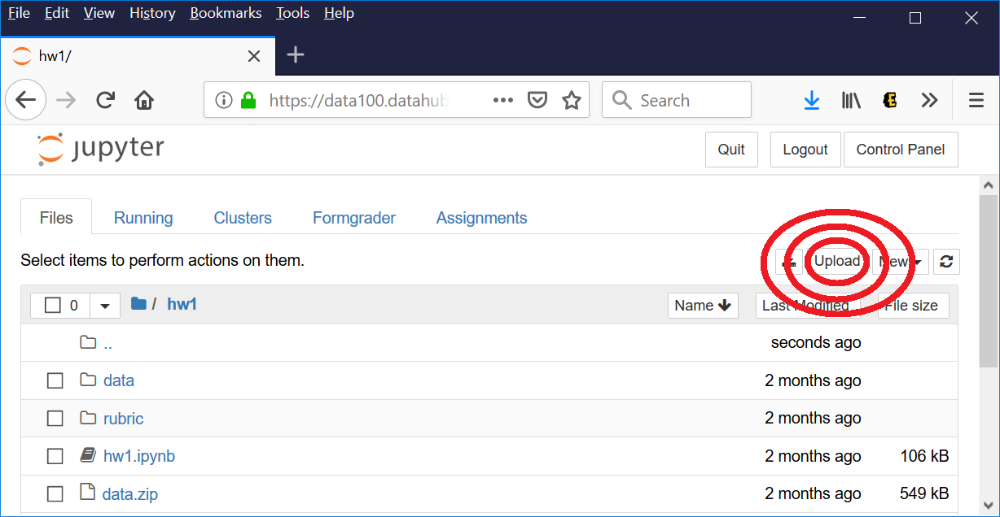

## Contents

- **Machine Installation**
  - [OSX](#osx)
  - [Windows](#windows)
  - [Linux](#linux)
  - [Chromebook](#working-on-jupyterhub)
- [Creating your environment](#creating-your-environment)
- [Working on assignments locally](#working-on-assignments-locally)
- [Opening notebooks locally](#opening-notebooks-locally)
    - [Verifying your environment](#verifying-your-environment)
- [Working on JupyterHub](#working-on-jupyterhub)

## OSX

1. You will need access to the command line. On a Mac, you can open the
   [Terminal](https://www.macworld.co.uk/how-to/mac-software/how-use-terminal-on-mac-3608274/)
   by opening Spotlight (Cmd + Space) and typing `"Terminal"`.  Alternatively, you can go to 
   your `Applications` screen and select `Terminal` (it might be in the folder named
   `"Other"`)

1. [Homebrew](https://brew.sh/) is a package manager for OSX.  If you haven't already, install it by
   running the following in the command line (copy, paste, and enter):

        # This downloads the Ruby code of the installation script and runs it
        /usr/bin/ruby -e "$(curl -fsSL https://raw.githubusercontent.com/Homebrew/install/master/install)"

   Verify your installation by making sure `brew --version` doesn't error at
   your terminal.

1. Download and install [Anaconda](https://www.anaconda.com/what-is-anaconda/):

        # Uses curl to download the installation script
        curl https://repo.continuum.io/miniconda/Miniconda3-4.3.31-MacOSX-x86_64.sh  > miniconda.sh

        # Run the miniconda installer (you will need to enter your password)
        bash miniconda.sh

1. Close and restart your terminal.

   Ensure the installation worked by running `conda --version`.

You may remove the `miniconda.sh` script now if you'd like.

[**Click here to continue to the next part of the setup.**](#creating-your-environment)

## Windows

Windows is especially prone to error if you aren't careful
about your configuration. If you've already had Anaconda or `git` installed and
can't get the other to work, try uninstalling everything and starting from
scratch.

### Installing Anaconda:

1. Visit [the Anaconda website](https://www.anaconda.com/download/#download) and download the installer 
   for **Python 3.7**. Download the 64-bit installer if your computer is 64-bit (most likely), the 32-bit
   installer if not. See [this FAQ](https://support.microsoft.com/en-us/help/15056/windows-7-32-64-bit-faq)
   if you are unsure.

1. Run the exe file to install Anaconda.
   Leave all the options as default (install for all users, in the default location).
   Make sure both of these checkboxes are checked:

   

1. Verify that the installation is working by starting the Anaconda Prompt (you
   should be able to start it from the Start Menu) and typing `python`:

   

   Notice how the `python` prompt shows that it is running from Anaconda. Now
   you have `conda` installed!

   **From now on, when we talk about the "Terminal" or "Command Prompt", we are
   referring to the Anaconda Prompt that you just installed.**

[**Click here to continue to the next part of the setup.**](#creating-your-environment)

## Linux

These instructions assume you have `apt-get` (Ubuntu and Debian).
For other distributions of Linux, substitute the appropriate package manager.

1. Your terminal program allows you to type commands to control your computer. On
   Linux, you can open the Terminal by going to the Applications menu and
   clicking "Terminal".

1. Install `wget`. This is a command-line tool that lets you download
   files / webpages at the command line.

        sudo apt-get install wget

3. Download the Anaconda installation script:

        wget -O install_anaconda.sh https://repo.continuum.io/miniconda/Miniconda3-4.3.31-Linux-x86_64.sh 

4. Install Anaconda:

        bash install_anaconda.sh

5. Close and restart your terminal.

   Ensure the installation worked by running `conda --version`.

You may remove the `install_anaconda.sh` script now if you'd like.

[**Click here to continue to the next part of the setup.**](#creating-your-environment)

## Creating your environment

These instructions are the same for OSX, Windows, and Linux.

1. Download the data100 `data100_environment.yml`] from the course repository 
   [here](assets/local_setup/data100_environment.yml) or:

        # download via curl
        curl https://raw.githubusercontent.com/DS-100/fa18/gh-pages/assets/local_setup/data100_environment.yml > data100_environment.yml

        # OR download via wget
        wget -O environment.yml https://raw.githubusercontent.com/DS-100/fa18/gh-pages/assets/local_setup/data100_environment.yml

This [YAML](https://en.wikipedia.org/wiki/YAML) file is what we use to specify the dependencies and packages (and their versions) we wish to install into the [conda environment](http://conda.pydata.org/docs/using/envs.html) we will make for this class.  The purpose of the environment is to ensure that everyone in the course is using the same package versions for every assignment whether or not they are working on datahub.  This is to prevent inconsistent behavior due to 
differences in package versions.

1. Using the **Terminal**, navigate to the directory where you downloaded `data100_environment.yml`. Run these commands to create a new conda environment. Each conda environment maintains its own package versions, allowing us to switch between package versions easily. For example, this class uses Python 3, but you might have another that uses Python 2. With a conda environment, you can switch between those at will.

        # sanity check on conda installation
        conda --version
		
		# update conda just in case it's out of date
		# enter y if prompted to proceed
		conda update conda
        
        # Create a python 3.6 conda environment with the full set
        # of packages specified in environment.yml (jupyter, numpy, pandas, ...)
        conda env create -f data100_environment.yml

        # Switch to the data100 environment
        source activate data100 # omit the 'source' part on Windows
		
		# Check if packages are in the environment
		conda list

From now on, you can switch to the `data100` env with `source activate data100`, and switch back to the default env with `source deactivate`. 
   
**Note**: If you are on Windows, omit the 'source' part and use `activate data100` and `deactivate`.

## Working on assignments locally

These instructions are the same for OSX, Windows, and Linux.

To work on assignments, you should fetch the assignment on datahub, navigate to the assignment folder and click on
the download icon on the top right:

Then you can unzip the files into a folder of your choosing.

Remember the location of your assignment files because you'll need to navigate to that folder to open the notebook.

## Opening notebooks locally

To open Jupyter notebooks, you'll navigate to parent directory of the assignment in your terminal,
activate the environment, and start up a jupyter server.  This will look something like:

	cd path/to/assignment/directory
    source activate data100 # omit the `source` part on Windows
    jupyter notebook

This will automatically open the notebook interface in your browser. You can then browse to a notebook and open it.

Make sure to **always** work in the `data100` conda environment when you are using jupyter notebooks for this class. This ensures you have all the necessary packages required for the notebook to run.

### Verifying Your Environment

You can tell if you are correct environment if your terminal looks something like:

Additionally,
    
    conda env list
    
outputs a list of all your conda environments, and `data100` should appear with a `*` next to it (the active one).

### Removing the environment to start over
  
If you feel as if you've messed up and need to start over, you can remove the environment with

	conda remove --name data100 --all
	
To verify that the environment was removed, in your Terminal window or an Anaconda Prompt, run:

	conda info --envs

Which should then no longer display the `data100` environment.

## Submitting your work

Submissions will still be handled via datahub.  To upload your work, navigate to the appropriate assignment
folder on datahub and click on the upload button on the top right.

